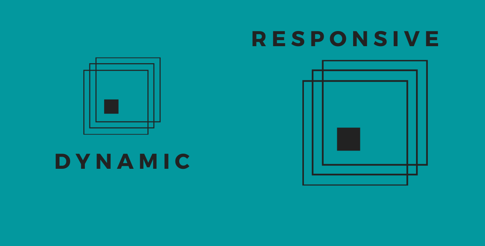
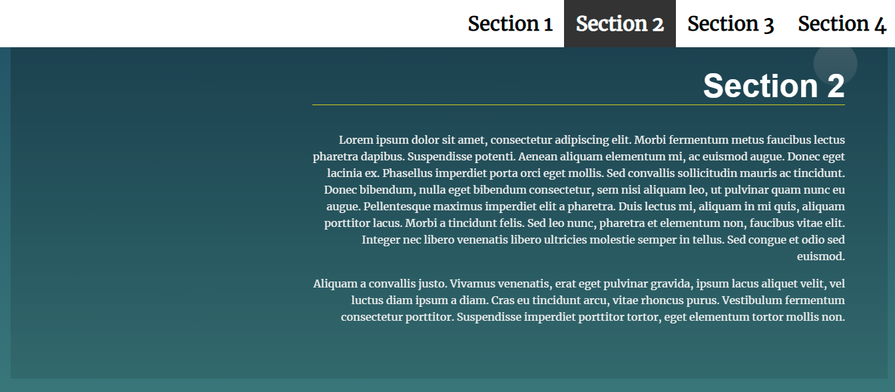
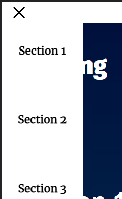
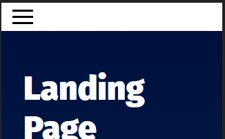

# Responsive Dynamic Landing Page

This project is a multi-section landing page with a navigation menu. The navigation menu is dynamically updated based on the existing number of sections and also it turns into a navigation button in mobile devices, which is cool.

# Table of contents

- [Installation](#installation)
- [Usage](#usage)
- [Development](#development)

# Installation

To use this project, first clone the repo on your device using the command below: 
<code>git clone https://github.com/Abdorithm/Udacity-Web-Development-Projects.git</code> 
Then, the repo will be downloaded on your machine.  
<em>You can also download it as a zip file or fork it to your account.</em> 
[(Back to top)](#table-of-contents)
# Usage

After installation, you'll be able to navigate through the project folder, the architecture 
of the project files is: 
<pre>css
- styles.css    
js
- app.js
index.html
README.md</pre>
<em>The assets folder and the banner photo are just for this <code>README.md</code> file and not a part of the code.</em>
### How to use?
1. Begin by opening the <code>index.HTML</code> in your browser, you'll see the display of the page. 
2. When clicking on a navigation item, the window will scroll smoothly to its location. 
3. When you're reading a section, it will have cool animations displayed with it. 

4. In small resolutions (mobile devices) the navigation will show up when clicking on its button. 

 

That's pretty much all there is to be.😊

[(Back to top)](#table-of-contents)

# Development

The main idea of this project is to manipulate the DOM using JavaScript. All of the features are 
processed as follows:  

### 1. Building the navigation.  
By iterating over sections using <code>forEach()</code> method, then creating <code>li</code> & <code>a</code> elements
and adding <code>class</code> & <code>href</code> attributes to the <code>a</code> elements. Finally populating the navigation
with them and using the HTML <code>data attribute</code> in each section to set the <code>textContent()</code> to each anchor accordingly.

### 2. Mobile Navigation.  
Using the CSS <code>@media</code> at-rule, The navigation menu is changed in smaller screen widths (<768 px) 
<pre>@media screen and (max-width: 767px) { /* new properties/design */ }</pre>
It's that simple. The JavaScript part is using <code>addEventListenerer()</code> & <code>classList.toggle()</code> to set the animations on a click event.

### 3. Highlighting a section when in the viewport.  
This is done by using <code>getBoundingClientRect()</code> method & <code>clientHeight</code> read-only property to get the position of each section 
relative to the viewport, then setting conditionals that add the animations by using <code>classList</code> if they're met.

### 4. Scrolling to sections.  
The <code>scrollTo()</code> event helps to smooth-scroll to a particular position. By using <code>offsetTop</code> read-only property, we can get the y/top coord of the
wanted section.  
When an anchor in clicked, the target section's ID is stored, as it is the <code>href</code> attribute of that anchor.
<pre>const targetSection = anchor.currentTarget.getAttribute('href');</pre>
and there you go, smooth-scrolling like a beast!🐱‍👤

[(Back to top)](#table-of-contents)

